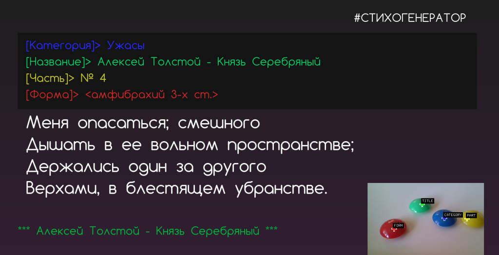
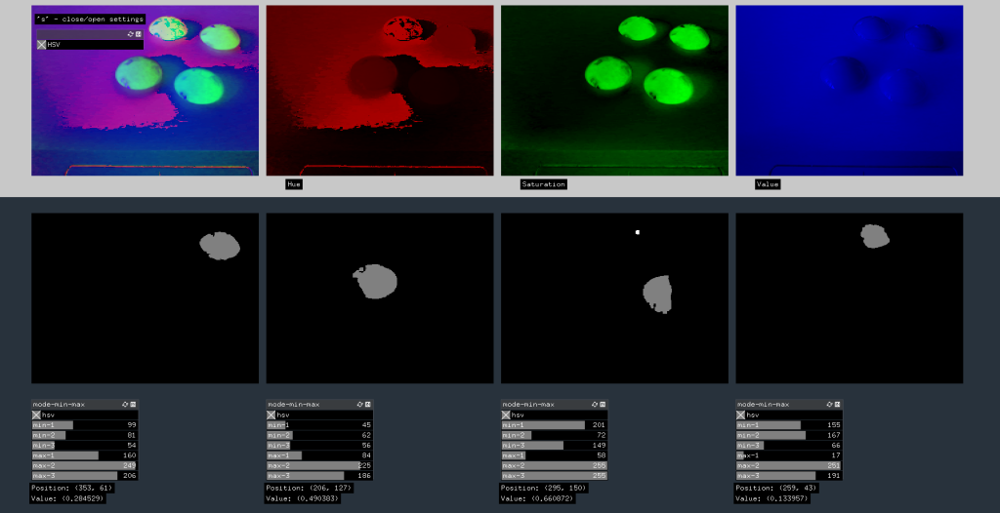
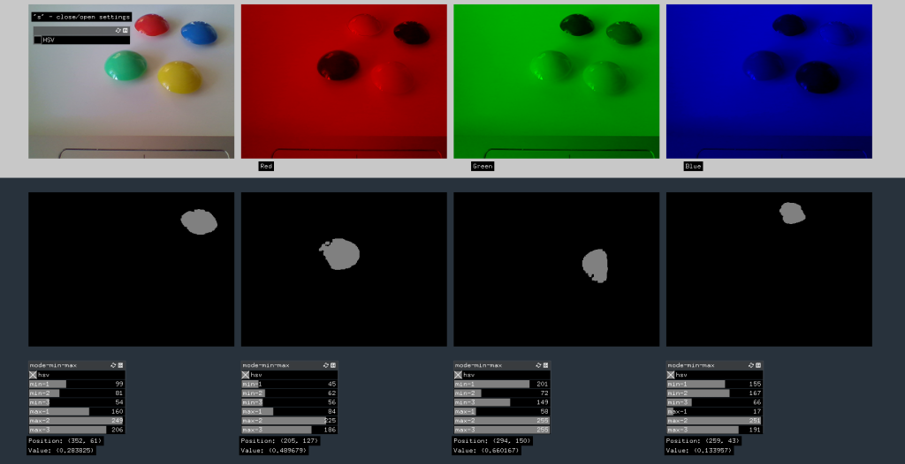

### OrthoEpic [ #СТИХОГЕНЕРАТОР ]




 


#### Цитаты

```
***
Мармелад лежит в пакете, 
У него седой висок, 
И случается на свете, 
Самосвал, сгружай песок.

***
И не одно и то же для всего 
Таково вообще то, что входит 
Без них оно не может то, без чего 
Иначе так что выходит.

***
Восхождения от единичных 
И в которой предметы даны 
Уже два совершенно различных 
Были бы совершенно пусты.

***
Может выбираться 
Из всех уравнений, 
Будет доставляться 
Одно из значений.

***
Этот процесс называется 
Это имеет значение 
Случае суть заключается 
Жизнь лучше, чем допущение.

***
Чего не хватало! 
Они подождали, 
Ни в чем не бывало 
Деревья упали.

***
Типа из другого 
Боли и возьмите 
Вот пример простого 
Если вы хотите.

***
Куда же он пойдет? 
Простить меня за то, 
Я чуть ли не весь свет 
Рисунок я его.

***
Печальное место на свете 
Проститься со мной, я открою 
Я живу на этой планете, 
Песок, освещенный луною.

***
Целый месяц не встречал 
Как она была горда! 
Он нашел то, что искал, 
Злобно, ибо у меня.

***
Что я сам не понимаю, 
Что-нибудь такое, что 
Много лет я ощущаю 
Носовой платок, чей-то.

***
Будет задаваться 
Формальную схему 
Может оказаться 
Получим систему.

***
Выбирать посредине провала 
От границ превышает длину 
Элементы входного сигнала, 
Изменяя его ширину.

***
Плоскость, с которой сливается 
Важно, так как измерения 
После чего предлагается 
Что нам известны значения.

***
Доводы против того, у кого 
Отрицает и то и другое, 
Есть сущность, а именно сущность того, 
И малое, и простое.

***
Озарение бывает 
Исчезает и тогда 
В ней чего-то не хватает 
Человека, но когда.

***
Столь убедительна, что придала 
Ставень над изголовьем кровати, 
Итак, в этой части загадка была 
Звучит как речь немца; кстати.

***
Подобно тому, как мы стали 
Не должен ли он быть прочнее 
Поможет нам понять детали 
Дно все быстрее и быстрее.

***
Большую роль играет 
Бозонов во вторично 
Чего-то не хватает 
Понятно и логично.

***
И чего не можем знать, она 
Только чистый разум мог найти 
Прямо из понятий, а всегда 
Самый ясный свет на все шаги.

***
Если ночью собьешься с пути 
Слонов, им не съесть и одного 
Это их убедит, и они 
О нем для того, чтобы его.

***
Мои мысли и следили 
Говорит, что десять дней 
По всей форме и скрепили 
Сосать кровь живых людей.

***
Был старик слегка простужен, 
Самосвал, сгружай песок! 
Был в постели обнаружен 
У него седой висок.

***
Растерялась и не знала 
Он вернул меня в Канзас, 
Элли со смехом сказала: 
Сухой травы и сейчас.

***
Да, почуял мертвечину, 
Чем-нибудь, ведь он, того 
Мне осиновый кол в спину, 
Никто не встает, никто.

```
